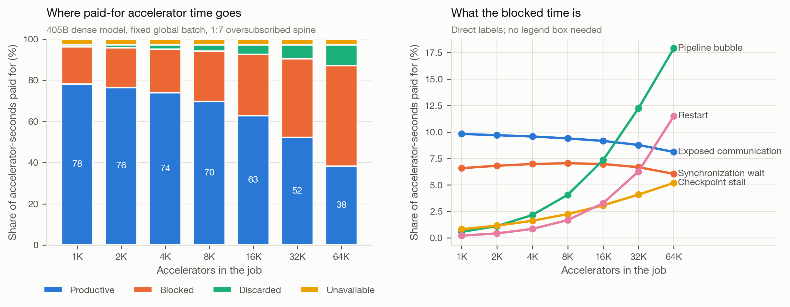
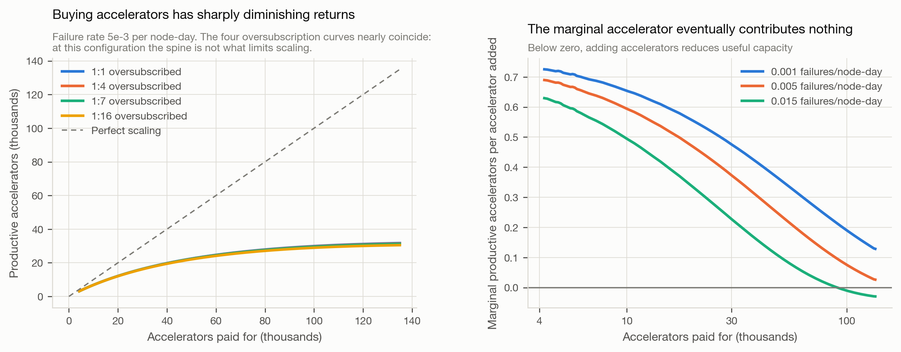
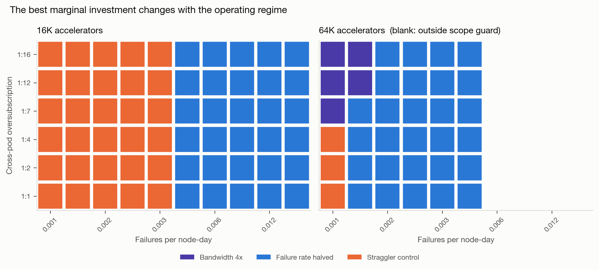
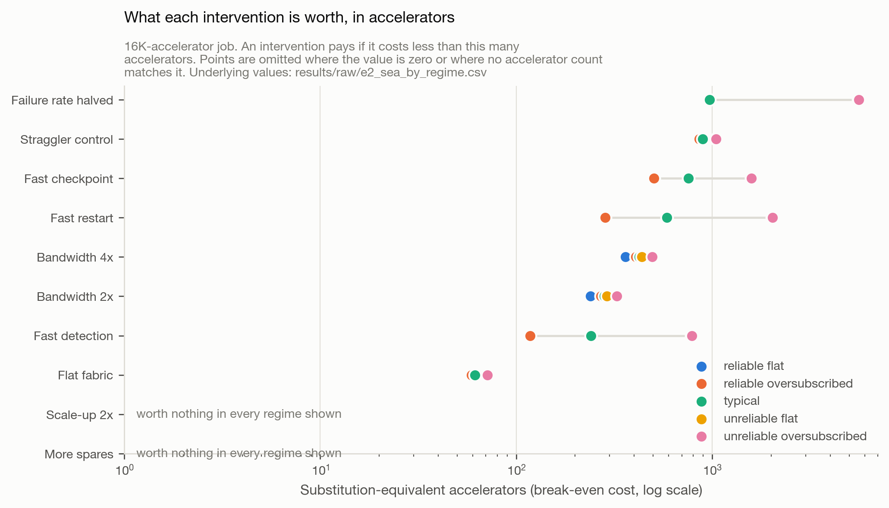
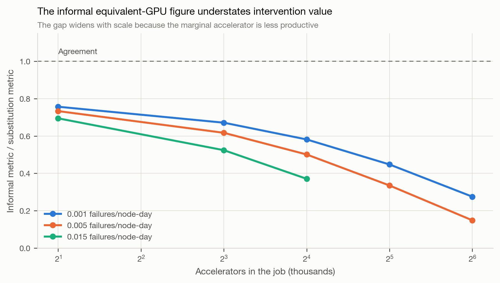
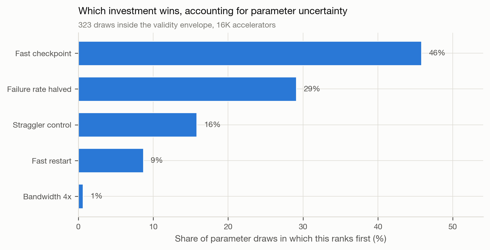

# Network capacity is sometimes compute capacity

**When is improving the network, reliability, or recovery of an accelerator fleet worth more than buying more accelerators, and where does that answer change?**

This repository contains the model, experiments, validation, paper, and article for a study of that question. It is a research artifact, not a product.

---

## The research question

Operators of large accelerator fleets repeatedly choose between buying more accelerators and improving the infrastructure around the ones they already own. The metrics in common use do not support that comparison. Model FLOPs Utilization measures how well a step runs and is blind to failures. Effective Training Time Ratio measures availability and credits communication stall as productive work. Neither expresses an infrastructure improvement in units comparable to an accelerator purchase.

## The contribution

1. **Four-fate accounting.** Every accelerator-second is assigned exactly one terminal fate: productive, blocked, discarded, or unavailable. The identity `P + B + D + U = N x T` is asserted numerically on every model evaluation.
2. **Substitution-Equivalent Accelerators (SEA).** An infrastructure change is priced as the number of additional accelerators that would deliver the same productive throughput. Because SEA is a break-even cost, the decision rule needs a ratio and not a price, so this project quotes no currency figures anywhere.
3. **Attribution for interacting interventions.** Shapley values over all subsets, with the measurement of how far from additive interventions actually are.
4. **Decision-boundary maps.** Which intervention is the strongest marginal investment in each operating regime, including the regimes where network investment is worth nothing.

Not contributed: a new simulator, a new communication model, or a new reliability model. Those exist and are cited. Standard formulations are reused deliberately so the predictions can be checked against independent tools and closed forms.

## What was simulated, and what was measured

**Everything here is analytical or simulated. Nothing was measured on hardware operated by the author.**

What could be done instead was validation against published measurements: one compute-side parameter was calibrated on a published 8,192-accelerator training configuration and then held fixed to predict a held-out 16,384-accelerator configuration of the same system.

## Strongest findings

| Finding | Number | Where it holds |
|---|---|---|
| Availability overstates capacity | ETTR 0.889 against useful capacity 0.627 at 16,384 accelerators, a 26.1 point gap | The reference configuration; the gap follows from the metric definitions |
| Useful capacity collapses with scale at fixed batch | Productive share falls from 0.781 at 1,024 accelerators to 0.382 at 65,536 | Strong scaling; validated at 8,192 and 16,384 |
| The informal equivalent-GPU metric is badly biased | Understates value by 1.4x at 2,048 accelerators, 6.2x at 65,536 | Structural, follows from marginal accelerator productivity |
| No single intervention dominates | Four different interventions rank first across 96 in-envelope regime cells | Failure rate by oversubscription grid at two scales |
| Bandwidth is rarely the best marginal buy at 16K scale | Ranks first in 0.6% of 323 uncertainty draws; halving the failure rate ranks first in 52.3% | 16,384 accelerators, documented parameter ranges |
| Recovery improvements are complements, not substitutes | Bundle worth 8.9% more than the sum of parts, against a hypothesis that predicted the opposite | All regimes tested |
| Beyond a point, accelerators cannot substitute at all | At ~131,000 accelerators productive throughput falls as the pool grows: 29,682 to 25,016 | Confirmed with the high-fidelity path; outside the fast path's envelope |

## What remains unvalidated

- **No hardware measurement anywhere in this project.**
- **Small jobs.** The per-node Poisson failure model reproduces published job MTTF at 16,384 and 131,072 accelerators within a few percent but misses the measured 1,024-GPU figure by 3.7x. Results below roughly 4,096 accelerators are indicative only. The source's own published figures are not mutually consistent under inverse scaling.
- **The substitution metric's output.** No published source reports a system measured before and after a network or reliability change, so the metric's inputs are validated but its output is not.
- **Correlated failures**, fault isolation, cross-campus pooling, inference, mixture-of-experts routing, and asynchronous training are all out of scope.

Full detail in [`validation/VALIDATION_REPORT.md`](validation/VALIDATION_REPORT.md), including a validation run that **failed** and what it changed.

## Reproduce a small result

```bash
make venv          # pinned virtual environment, Python 3.12
make smoke-test    # tests, external validation, two experiments. Under a minute.
```

## Reproduce everything

```bash
make reproduce     # tests, validation, all 9 experiments, all figures, the paper PDF
```

The full program runs in about **10 seconds** on a laptop. No accelerator access, no cloud resources, and no paid compute are required at any point. The test suite runs in under a second.

## Where the outputs are

| Artifact | Location |
|---|---|
| Paper (LaTeX and compiled PDF) | [`paper/main.tex`](paper/main.tex), `paper/main.pdf` |
| Technical article | [`article/article.md`](article/article.md) |
| Research charter | [`RESEARCH_CHARTER.md`](RESEARCH_CHARTER.md) |
| Metric definitions | [`docs/metric_framework.md`](docs/metric_framework.md) |
| Literature analysis and white space | [`docs/literature_matrix.md`](docs/literature_matrix.md) |
| Evidence ledger | [`SOURCES.md`](SOURCES.md) |
| Decision log | [`DECISIONS.md`](DECISIONS.md) |
| Assumptions and their ranges | [`ASSUMPTIONS.md`](ASSUMPTIONS.md) |
| Validation report | [`validation/VALIDATION_REPORT.md`](validation/VALIDATION_REPORT.md) |
| Current status and next steps | [`STATUS.md`](STATUS.md) |

## Figure gallery

| | |
|---|---|
|  |  |
| **Where paid-for accelerator time goes** as job size grows. Productive share falls from 78% to 38%. | **Diminishing returns.** The marginal accelerator's contribution falls toward zero, and below it at high failure rates. |
|  |  |
| **The decision map.** Four different interventions rank first depending on regime and scale. | **Break-even costs.** How much each intervention may cost, in accelerators, before it stops paying. |
|  |  |
| **The informal equivalent-GPU metric** understates value by up to 6.2x, worsening with scale. | **Rank stability** over 323 draws from documented parameter ranges. |

## Configuration example

Experiments are driven by YAML, never by hard-coded parameters. Fields are tagged `[published]`, `[derived]`, `[calibrated]`, or `[assumed]` so any number can be traced to its basis.

```yaml
topology:
  scaleup_domain: 8        # [published] 8-accelerator scale-up domain
  pod_size: 3072           # [published] full bisection within a pod
  oversubscription: 7.0    # [published] 1:7 across pods
  net_efficiency: 0.85     # [assumed] achievable fraction of line rate

reliability:
  failure_rate_per_node_day: 5.0e-3   # [published] SOURCES.md S2
  detect_time_s: 120                   # [assumed], swept 30-400 in E7
  checkpoint_interval_s: null          # null selects the Daly optimum
```

Interventions are also declarative, in [`configs/interventions.yaml`](configs/interventions.yaml).

## Using the model directly

```python
from netcap import load_scenario, build_ledger, Intervention
from netcap.metrics import substitution_equivalent_accelerators

scenario = load_scenario("configs/scenarios/reference_405b_16k.yaml")
ledger = build_ledger(scenario)
print(ledger.useful_capacity_fraction)          # 0.627
print(ledger.effective_training_time_ratio)     # 0.889

result = substitution_equivalent_accelerators(
    scenario, Intervention("bandwidth_2x", {"accelerator.nic_bw_gbps": 800.0})
)
print(result["sea"])   # 281: worth funding if it costs less than 281 accelerators
```

## Data provenance

- `results/raw/` is **immutable**. Every file has a `.meta.json` sidecar recording the model version, git commit, random seed, baseline scenario name, and a configuration digest. Figure scripts read these and never write them.
- `results/processed/` is generated from raw results by `experiments/summarize.py`. Every number quoted in the paper, the article, and this README appears there.
- `results/validation/` holds the external validation output.
- No raw file is edited by hand at any point. No result was adjusted to improve a conclusion.
- No dataset from a third party is redistributed here. Published values used for calibration and comparison are quoted in `SOURCES.md` with their source, and each source was opened before being cited.

## Runtime and compute expectations

| Command | Time | Requirements |
|---|---|---|
| `make test` | under 1 s | none |
| `make validate` | under 1 s | none |
| `make experiments` | about 10 s | none |
| `make figures` | about 5 s | none |
| `make paper` | about 30 s first run | `tectonic` |

## Limitations

Stated in full in the [validation report](validation/VALIDATION_REPORT.md) and the paper. The short version: no hardware measurement, a failure model that is optimistic for small jobs, an assumed strong-scaling policy, an assumed dense rank placement that is conservative with respect to this project's own thesis, and a substitution metric whose output has no published counterfactual to check against.

The model also declares a **validity envelope**. Where recovery pressure (the share of runtime consumed by discarded work plus restart) exceeds 0.25, the fast analytical path diverges from the event-driven path by up to 29.6%. Those rows are flagged in the raw output and excluded from headline claims; where such a case matters it is recomputed at high fidelity.

## Citation

See [`CITATION.cff`](CITATION.cff), or:

```bibtex
@misc{nanyonga2026netcap,
  author = {Nanyonga, Margaret},
  title  = {Network capacity is sometimes compute capacity: an accounting framework
            and decision boundaries for infrastructure investment in large-scale
            AI training},
  year   = {2026},
  url    = {https://github.com/dimaggi-ai/network-vs-more-gpus},
  note   = {Version 1.0.0}
}
```

## License

Code under the [MIT License](LICENSE). The paper and figures are the author's own work; published values quoted from third-party sources remain the property of their authors and are cited in `SOURCES.md`.
